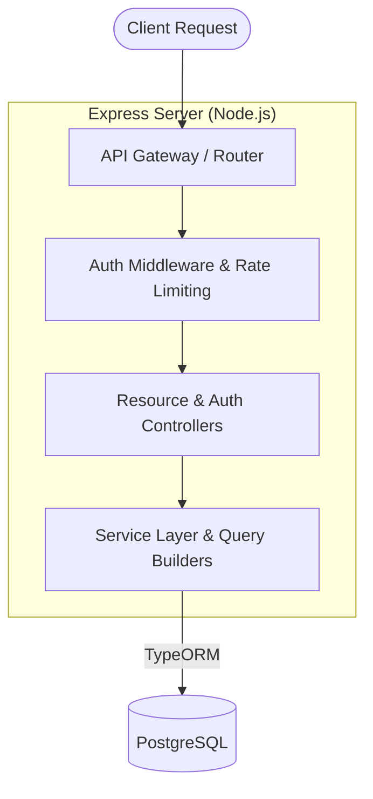

# QuangNVV3 FSO_Smart API Hub

    

**🌐 Live Demo:** [https://smart-api-hub-2-e972.onrender.com/health]

**Smart API Hub** is an advanced, production-ready backend boilerplate built with **Node.js**, **Express**, **TypeScript**, and **TypeORM**. It automatically generates dynamic RESTful CRUD endpoints and database tables based on a predefined `schema.json`. It is fully equipped with authentication, rate-limiting, data validation (Zod), and Swagger documentation.

---

## 🌟 Key Features

- **⚙️ Dynamic REST API:** Automatically maps API routes (`GET`, `POST`, `PATCH`, `DELETE`) to your database entities based on `schema.json`.
- **🗄️ Auto DB Migration:** Reads `schema.json` and dynamically generates PostgreSQL tables, columns, and relationships without manual SQL scripts.
- **📝 Built-in Audit Logging:** Automatically and asynchronously tracks all data-modifying events (CREATE, UPDATE, DELETE) into an `audit_logs` table. It securely captures `user_id`, `action`, `resource_name`, `record_id`, and `timestamp` in the background (fire-and-forget), ensuring zero impact on API response times.
- **🔐 Authentication & Security:** Includes JWT-based authentication, password hashing (bcrypt), and Role-Based Access Control (RBAC). Includes advanced Rate Limiting.
- **🛡️ Robust Validation:** Built-in payload validation and sanitization using **Zod**.
- **🐳 Fully Dockerized:** `docker-compose` setup pre-configured for running the App and PostgreSQL database smoothly in isolation.
- **📖 Swagger Documentation:** Out-of-the-box OpenAPI specs available at `/api-docs`.
- **✅ Automated Testing:** Integrated unit test suite configured via Vitest/Supertest.

---

## 🏗️ Architecture Diagram



---

## 🚀 Getting Started

You can run this project locally or using Docker. **Docker is highly recommended** for the best out-of-the-box experience.

### Prerequisites
- [Docker](https://docs.docker.com/get-docker/) & [Docker Compose](https://docs.docker.com/compose/install/) (Recommended)
- [Node.js](https://nodejs.org/en/) (v18+ if running locally)
- [PostgreSQL](https://www.postgresql.org/) (if running locally)

### 🐳 Quick Start with Docker

1. **Clone the repository and prepare the environment:**
   ```bash
   cp .env.example .env
   ```
   *(Update the `.env` file with your preferred credentials if necessary. The default works perfectly for local Docker testing).*

2. **Spin up the application stack:**
   ```bash
   docker-compose up --build
   ```
   *This command will:*
   - Start the PostgreSQL database container.
   - Wait for the database to be healthy.
   - Automatically run migrations (`npm run migrate`).
   - Start the Express application in development mode with hot-reload.

3. **Verify the server is running:**
   ```bash
   curl http://localhost:3000/health
   ```

### 💻 Local Development Setup (Without Docker)

1. Ensure your local PostgreSQL is running and update `.env` with your host (`localhost`), port, user, password, and database name.
2. Install dependencies:
   ```bash
   npm install
   ```
3. Run the database migration script to generate tables:
   ```bash
   npm run migrate
   ```
4. Start the server in watch mode:
   ```bash
   npm run dev
   ```

---

## 📚 API Documentation

Once the server is running, you can access the interactive Swagger UI here:
👉 **[http://localhost:3000/api-docs](http://localhost:3000/api-docs)**

### 📌 Core Endpoints Overview

| Endpoint | Method | Description |
|----------|--------|-------------|
| `/health` | `GET` | Health check for the server and DB connection. |
| `/auth/sign-up` | `POST` | Register a new user (`email`, `password`, `role`). |
| `/auth/sign-in` | `POST` | Authenticate and obtain a JWT access token. |
| `/users/:id` | `PATCH`/`DELETE`| Update or remove users (requires Auth). |
| `/api/:resource` | `GET`/`POST` | **Dynamic:** Fetch or create records for any resource defined in `schema.json`. Contains built-in pagination (`_page`, `_limit`), sorting (`_sort`, `_order`), and searching (`q`). |
| `/api/:resource/:id` | `GET`/`PATCH`/`DELETE` | **Dynamic:** Fetch, update, or delete a specific record by ID. |

---

## 🛠️ Configuration & Customization

### Modifying the Database Schema
The database architecture is driven by `schema.json`. To add a new table (e.g., `products`), simply edit the file:
```json
{
  "products": [
    {
      "id": 1,
      "name": "Product Name",
      "price": 100,
      "in_stock": true
    }
  ]
}
```
Then restart the server or re-run `npm run migrate`. The system will automatically create the `products` table with `name (TEXT)`, `price (INTEGER)`, `in_stock (BOOLEAN)`, and auto-generate the `/api/products` REST endpoints!

---

## 🤝 Contributing

We welcome contributions! 
- Please make sure to not commit the `.env` file or any environment secrets. 
- Ensure the code passes all linters and tests before submitting a Pull Request.

---

*Powered by Node.js, Express, and TypeORM.*
