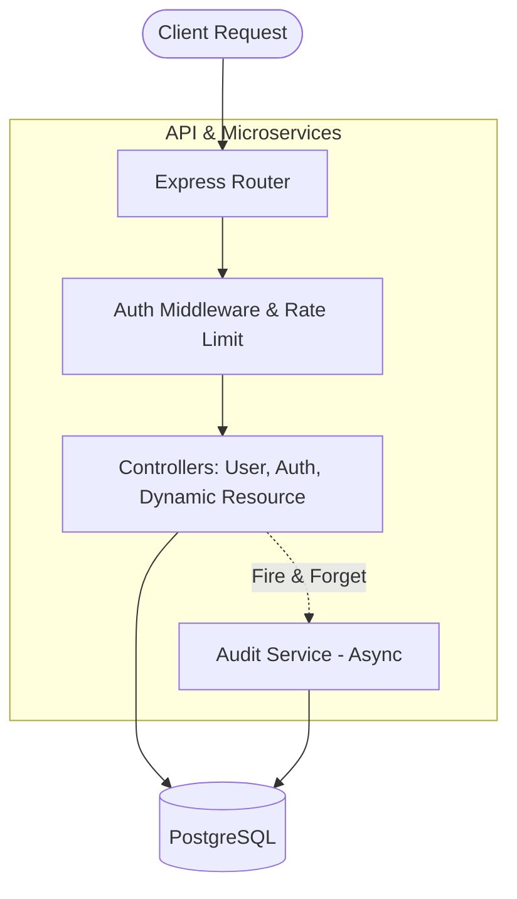

# Smart API Hub

Smart API Hub is an advanced boilerplate backend system utilizing Node.js, Express, TypeScript, and TypeORM with PostgreSQL. It automatically generates dynamic CRUD endpoints based on predefined schemas, offering a built-in Audit Logging feature for all WRITE operations (CREATE, UPDATE, DELETE).

## Architecture Diagram



## Features
- **Dynamic Database Migration**: Creates SQL Tables sequentially reading from `schema.json`
- **Audit Logs**: Transparently tracks (CREATE/UPDATE/DELETE) actions into `audit_logs` asynchronously (fire and forget), preserving request processing speed.
- **Role-based Authentication**: JWT integration for user sign-in and protected routes.
- **Containerized**: `docker-compose` ensures identical execution regardless of the OS host.
- **RESTful Endpoints & Swagger ui**: Pre-defined REST specs available on `/api-docs`.

## Getting Started

Follow the instructions below to run this project seamlessly using Docker.

### Prerequisites
- [Docker](https://docs.docker.com/get-docker/) installed.
- [Docker Compose](https://docs.docker.com/compose/install/) available.

### Setup & Run
1. Make a copy of `.env.example` as `.env` (it will be automatically loaded by Docker)
    ```bash
    cp .env.example .env
    ```

2. Spin up the application stack
    ```bash
    docker-compose up --build
    ```
    *(If you'd like to run it in the background, append `-d`)*

3. Once booted, the setup script inside the container will automatically:
    - Run DB migrations if the tables are absent based on `schema.json`.
    - Run `nodemon` server starting up on `PORT 3000`.

### Health Check
Ensure your API successfully connects to the PostgreSQL database out of the box:
```bash
curl http://localhost:3000/health
```

### Endpoints (Sample overview)
- **POST** `/auth/signup` - Register a new user
- **POST** `/auth/signin` - Obtain a JWT tokens
- **GET/POST/PATCH/DELETE** `/api/:resource` - Generic REST interface mapped from schemas dynamically
- **GET** `/api-docs` - View Swagger OpenAPI UI

## Contribution Guideline
The `.env` file is heavily guarded via `.gitignore`. Never commit credentials. Ensure you leave your code pristine and properly linted before pushing.
